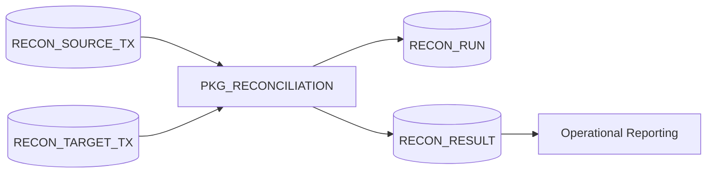
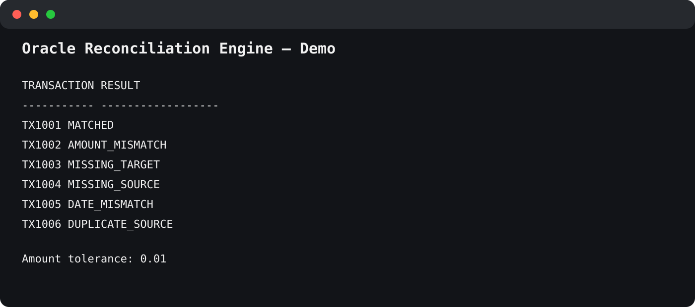

# Oracle Reconciliation Engine

<p align="center">
  
  
  
  
</p>

> **PL/SQL reconciliation for transactional and banking-style datasets.**

## Architecture



<p align="center"></p>

A reusable Oracle PL/SQL reconciliation engine for comparing two transactional data sets and classifying differences.

Typical use cases:

- core banking vs payment gateway;
- source ledger vs accounting system;
- operational store vs warehouse;
- settlement file vs internal transactions.

## Reconciliation outcomes

```text
MATCHED
MISSING_SOURCE
MISSING_TARGET
AMOUNT_MISMATCH
DATE_MISMATCH
CURRENCY_MISMATCH
DUPLICATE_SOURCE
DUPLICATE_TARGET
```

## Installation

```sql
@install.sql
```

## Run the reconciliation

```sql
declare
    l_run_id number;
begin
    l_run_id := pkg_reconciliation.run(
        p_amount_tolerance => 0.01
    );

    dbms_output.put_line('Run ID = ' || l_run_id);
end;
/
```

Or:

```sql
@tests/01_run_reconciliation.sql
@tests/02_reporting_queries.sql
```

## Matching logic

Records are grouped by `TRANSACTION_REF`.

When both sides exist, the engine evaluates in this order:

1. source duplicates;
2. target duplicates;
3. currency mismatch;
4. amount mismatch;
5. date mismatch;
6. otherwise `MATCHED`.

The ordering is intentional: duplicate conditions should be resolved before trusting field-level comparisons.

## Amount tolerance

`p_amount_tolerance` defines the maximum allowed absolute difference.

Example:

```text
Source amount: 100.001
Target amount: 100.000
Tolerance:       0.01
Result: MATCHED
```

## Reporting

```sql
select result_status,
       count(*) result_count,
       sum(abs(amount_difference)) total_abs_difference
from recon_result
where run_id = :run_id
group by result_status
order by result_status;
```

## Design & Engineering Decisions

### Reconcile by business transaction reference
The demo uses `TRANSACTION_REF` as the matching key. Production systems can extend this to composite keys.

### Detect duplicates before attribute comparison
Duplicate records are classified before amount or date mismatches so aggregation does not hide a more fundamental data-quality problem.

### Preserve every reconciliation execution
`RECON_RUN` stores execution metadata while `RECON_RESULT` stores transaction-level outcomes, providing historical auditability.

### Make amount comparison tolerance-aware
Rounding differences are handled by an explicit parameter instead of a hidden hard-coded threshold.

### Use explicit business classifications
Meaningful result codes are more useful operationally than a generic error flag.

### Keep matching deterministic
Each transaction reference receives one primary status according to a documented precedence order.

### Store measured differences
`AMOUNT_DIFFERENCE` captures the magnitude of mismatches, not only the fact that one exists.

### Separate reconciliation from exception workflow
Ownership, comments, approvals and sign-off are deliberately left to a future workflow/APEX layer.

## Key Takeaways

- Reconciliation is a business process, not just a SQL join.
- Duplicate detection should be explicit.
- Tolerances should be configurable and visible.
- Historical runs and detailed outcomes are essential for auditability.
- Clear classifications simplify investigation and reporting.

## Skills demonstrated

Oracle Database · SQL · PL/SQL · Reconciliation · Banking Data · Data Warehousing · Auditability · Tolerance-Based Comparison

## Possible extensions

- configurable composite matching keys;
- FX conversion;
- date tolerances;
- one-to-many matching;
- APEX reconciliation dashboard;
- exception ownership and sign-off;
- ETL batch integration;
- automatic reprocessing.

## LinkedIn

A LinkedIn-ready project entry is available in [docs/linkedin-project.md](docs/linkedin-project.md).

## License

MIT License. See [LICENSE](LICENSE).
